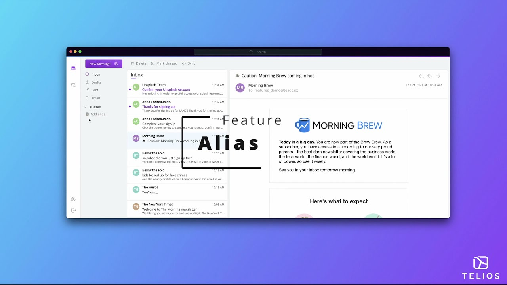

import useBaseUrl from '@docusaurus/useBaseUrl';

## Keep your inbox free from unwanted emails.

Beyond the potential risk of having your email address compromised by a hacker or a greedy third party, online services make it very hard to unsubscribe from their platform and you’ll never be 100% sure that your email address was deleted from their database. Aliases help you to classify the services you sign up for and better control your email inflow. 

Click on the video thumbnail below to learn how to create and use alias or/and follow our guide.

### Step 1 - Log into your account or sign up.

Log into your Telios account. If you don’t have an account sign up for the waitlist [here](https://www.telios.io/).

### Step 2 - Create your namespace. 

The first time you add an alias you will be asked to create your namespace. 

    

 

Your namespace helps link your Telios account to your alias address(es). 

- **Option 1**: Randomly select your namespace.
- **Option 2**: Enter the namespace of your choice.

    

 

:::note

A unique public and private public keypair are generated for each alias namespace for added privacy and security.

:::

### Step 3 - Create your alias(es).

 

    

 

Your alias will create a folder named after your chosen alias. Every email sent to your alias will be received in that alias folder.

- **Option 1**: Randomly select your alias.
- **Option 2**: Type down the alias of your choice.

**Optional** - Forwarding Addresses

You can add forwarding addresses, so every mail sent to your alias address will be sent to your chosen forwarding address(es). 

    

### Step 4 - Manage your alias.

 

    

 

Edit, deactivate, delete or add an alias.

    

 

Aliases can inform you on which companies are selling your data. Let’s say you create an alias for your Facebook account and decide to name your alias Facebook. If you happen to receive emails in your Facebook folder from companies other than Facebook, it means your alias has been compromised, probably sold to a third party. You can now deactivate your alias to block every service assigned to it. In one switch, you save yourself from going through endless subscription processes or worrying about your personal information being sold.
