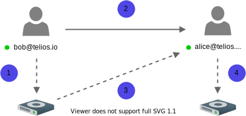
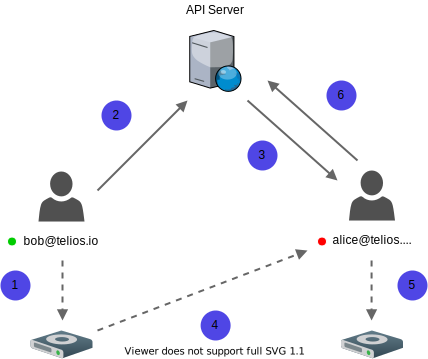
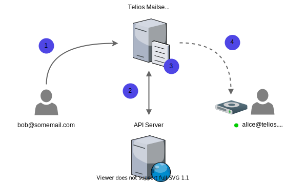

Our guiding principles regarding email have been to use centralized servers as little as possible and store the least amount of encrypted data needed to deliver a full-feature email service. We also wanted to support sending and receiving emails from outside the network (from Gmail, Yahoo, etc.) so that the Telios platform could become a viable alternative for users looking to migrate from services like Gmail.

## Terms

### Retrieval Metadata
Retrieval metadata refers to the encrypted metadata sent to the API server containing instructions for the recipient(s) on how to retrieve their email from the sender's drive. The encrypted metadata's outer layer includes the recipient's public key and the message, which is encrypted using the [sealed box](encryption#sealed-box-encryption) method. Decrypting the outer layer will provide the recipient with the information needed to retrieve their email from the sender's drive.

#### Metadata - Encrypted Outer Layer
``` javascript
{
  sbpkey: '03e4dcded30c1adea6a31076de3d223fb6107ca34910c716d42c23ebf119eb19',
  msg: 'b1b52260b297c3544bea20b891d744bee6e9e1e31af9ceccb70bd4f822797efe0f0305b81a532e4106d1c4d47a7dbaf8f9e59bb0f8eb416575421107cbeb8eabff648ce4644ea6af3c60d1053f81d0d774fa02ea4b9220986a4143f005702b2e43d68d84a6be36e831116cec44c57af13b3bfca7c379b9b13bd9edd2b4676a5f795effef7d4cc99f035f881ff35fd018b68d76d8b58fc86a19f1f79ab050d04054a7067da4d76b833b45d4c1f6e5418357b41978571cf593fb335c244fbcb4e3b3d42859782b2814276ef2183cf5b7af03e9b274801c8ff473b66c700d7abfa36ddbc6201874c8ade8cd33c93c4e026fa9faa34b76e3e0efd64b72ac2a3589bead90c244d453c97f99c17d396b89e6fe938add1dbe22d0c29cbea1a22623ad95dd1ef45774d1a95b721f1bcffe88c1edcfe6dbe708775f73ee6820336b7ef66300cfb18c5145399a20b6af556502f689c1fb6420b6023377b3608250baeac2edd63468885a2d11161b93512a9571622115883a4b2294d189c6330f21b8d888c63569e99b15b97061d2165c40dac4fde2297ba004ee1e6ed47146dd138a6821bdfcce48466d1bf09690918f322794ff91d83209dd80ef825abdd62c80bd60c41c18c1341284199c348263cb06f216294a7c2978010aedab83c7c785070d91fcc51021922dc6c9fde7dad4d002e07ae80c41f9ac5d667cd49ac6104e2f4c3cae0ee6fa3ddb2c05a4c1bf36141d138c96104e82fc84b53ae82da84748a5c3a646ee52e5b1d2f75d1bb231ab372badbb120f755d8fae8af705a26989dcc422f8d1e5c2b3e98c6447464b8b8360665a9b921890a90e0791697bf4cfe0bbfbddffa48f95c405ce99db35c4eedbc71974ff6b8e0788b707bb6f42a2b43848de9536c832cd9d283cd5fce8f4f0b0899f91df8e0d7ece338abfc93d1b29b6b281c07b946a0b0c735b6cb98730d1c43cb6020a627ecf69b373920cd712a4aff86b630c7823f8c174a25167509c362e3dec9171e8bef9f884eb2a72d79f4521a70961c01002480e219c39ea772cd3f7d2dfffbe7f8e39857c87cc447085d2a4efa2f3ca397b021979f66c8f633f8150f8a943d7a4fe7057322cc7e675541856b7827ac80ea53b2136504ef78af3f975fa20a392c16f59a040bd362654cf9812836becf'
}
```

#### Metadata - Decrypted Outer Layer
```javascript
{
  key: '247c1d582619e8d874ea270713825f01526b1222bd78313a3318163e67b773cf', // secret key
  header: 'a1f4b1595a2f780e8b2c14542d949b9e294b76055d548bc1',
  drive: 'hyper://7b308548d91af16e826ea875c8503953c36f5c2956fda6a769ab8c614413d93e', // Sender's public hyperdrive address
  path: '6333b82c-cb09-4a6f-b60c-40deee7607ea' // name of the file
  sig: 'b9af22edc918013cb60ff8aa4713e25fa919bd9199378f0cf6650b39c668099e06652d6f575108f9301a2550ba51ad4802bbf2ed64293377386e0305669b26f0' 
  // Bob's signature to verify this message came from him
}
```

:::note

This is only required when the recipient is offline and is unable to receive thier message through the peer-to-peer network.

:::


---

## Receiving Emails
The mail server will determine the appropriate delivery method when receiving an email from either outside or inside the Telios network. The client will always prefer to receive data over the peer-to-peer network and only use alternative methods when clients are offline.

### Peer-to-Peer
Emails are delivered through the [peer-to-Peer](p2p) network when the sender and recipient(s) are online and the sender has the recipient's discovery key. Discovery keys are public addresses used to find peers on the network. The [discovery key](p2p) is stored locally when creating new contacts and automatically used when sending new emails over the network.

---

**Scenario:** Bob wants to send Alice an email. Both Bob and Alice have mailboxes on the Telios network and are both online.




1. After Bob finishes composing his email and hits send, his client encrypts his email and streams it to his local drive.
2. Using Alice's public discovery key, Bob sends Alice encrypted [retrieval metadata](email#retrieval-metadata) with instructions on how she can retrieve Bob's email.
3. Alice decrypts Bob's metadata uses the drive's location and email path to connect to Bob's drive and streams the email back to her client.
4. Alice decrypts the stream using the secret encryption key Bob sent in the encrypted metadata and then encrypts and stores the email on her drive.

---

**Scenario:** Bob wants to send Alice an email. Both Bob and Alice have mailboxes on the Telios network, but Alice and her drive are offline.



1. After Bob finishes composing his email and hits send, his client encrypts his email and streams it to his local drive.
2. Using Alice's public key, Bob encrypts a small amount of metadata and sends it to the server. This metadata contains the location of Bob's drive that Alice needs to connect to, the location of the email on the drive, and the secret encryption key Alice will use to decrypt Bob's email.
3. When Alice logs back online, her client polls the messages database to check for emails that were sent to her while she was offline. These messages are encrypted metadata that can only be decrypted by their recipients. Neither Telios or anyone other than the intended recipient can view who these messages are from.
4. Alice decrypts the metadata and uses it to stream her email from Bob's drive.
5. Alice decrypts Bob's email with the secret key from the decrypted metadata and re-encrypts and stores it on her drive.
6. Alice then deletes the encrypted metadata off the server to remove any trace of the transaction.


### External Emails 
Our mail server supports receiving emails from providers that do not use our protocol. The mail server adheres to our strict security and privacy policies. It does not create logs or store emails in plain text, and after the public keys are retrieved, emails are immediately encrypted and streamed to either the mail server's peer-to-peer drive or directly to the recipient(s).

---

**Scenario:** Bob wants to send an email to Alice's Telios mailbox.



1. Bob's email provider sends his email to the Telios mail server.
2. The Telios mail server checks the recipient list for Telios accounts from the email metadata.
3. The account public keys are returned back to the mail server where they are used to encrypt the email retrieval metadata if a peer-to-peer connection cannot be made with the recipient(s).
4. If the recipient(s) are online, the mail server will stream the encrypted email directly to the recipient(s) drive.

---

**Scenario:** Bob wants to send an email to Alice's Telios mailbox, but Alice is offline.


1. Bob's email provider sends his email to the Telios mail server.
2. The Telios mail server checks the recipient(s) for Telios accounts from the email metadata.
3. The account public keys are returned back to the mail server where they are used to encrypt the email retrieval metadata.
4. If the recipient(s) are offline, the mail server posts the encrypted email retrieval metadata to the server for Alice to retrieve and decrypt when she comes back online.
5. The mail server encrypts the email with a unique secret key and streams it to the mail server drive.
6. Alice comes back online and pulls the retrieval metadata from the server.
7. After decrypting the retrieval metadata, she uses the instructions to connect to the mail server's drive and stream the email back to her client where she decrypts the message and saves it onto her personal drive.
8. After she confirms she has the email, she then signals to the server she has retrieved the email and the retrieval metadata is destroyed along with the encrypted email on the mail server's drive.

:::note

Encrypted emails are only stored on the mail server's drive for 30 days. If the account has maxed out its storage limit, the mail server will remove the oldest emails to make room for new messages.

:::

## Sending Emails
Sending emails to external mailboxes is fairly straightforward. The email JSON is sent to the API server in plain text and uses SMTP to deliver the message to Bob's external mailbox. These emails only pass through the API and mail server to deliver Bob's email and are never logged or stored.

External mailboxes that do not support end-to-end encryption will have to be sent in plain text to be delivered. We do everything on our end to ensure as much privacy as possible, but it should be noted these types of emails will not be encrypted when delivered to their recipient(s) or when they're passing through our servers.


1. Alice encrypts her email and stores it on her drive.
2. She then sends the plain text email to the API server.
3. The mail server delivers Bob's message via SMTP to his external mailbox

:::note

When sending an email with a mix of recipients with Telios and external mailboxes, the email will still be delivered as plain text to the API server and delivered to all Telios recipients as an [incoming external email](email#external-emails).

:::
