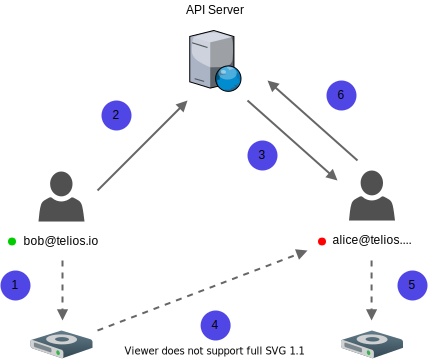
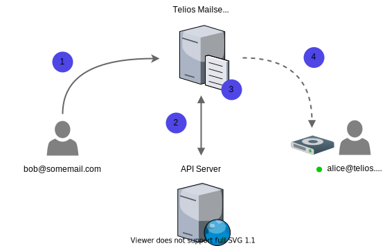

Our guiding principles regarding email have been to use centralized servers as little as possible, and to store the least amount of encrypted data needed in order to deliver a full-feature email service. We also wanted to support sending and receiving emails from outside the network (from Gmail, Yahoo, etc..), so that the Telios platform could become a viable alternative for users looking to migrate from services like Gmail.

## Receiving Emails
When receiving an email from either outside or inside the Telios network, a check will be done to determine the appropriate method for delivery. The client will always prefer to receive data over the p2p network and only use alternative methods when clients are offline.

### Peer-to-Peer
Emails are delivered through the [Peer-to-Peer](p2p) network when the sender and recipient(s) are online and the sender has the recipient's discovery key. Discovery keys are public addresses used to find peers on the network. The [discovery key](p2p) is stored locally when new contacts are created and is automatically used in the background.

---

**Scenario:** Bob wants to send Alice an email. Both Bob and Alice have mailboxes on the Telios network and are both online.

1. After Bob finishes composing his email and hits send, his client encrypts his email and streams it to his local drive.
2. Using Alice's public discovery key, Bob sends Alice encrypted metadata with instructions on how she can retrieve Bob's email.
3. Alice decrypts Bob's metadata and verifies it's authenticity. She then uses the drive's location and email path to connect to Bob's drive and streams the email back to her client.
4. Alice decrypts the stream using the secret encryption key Bob sent in the encrypted metadata and then encrypts and stores the email on her drive.

---

**Scenario:** Bob wants to send Alice an email. Both Bob and Alice have mailboxes on the Telios network, but Alice and her drive are offline.

1. After Bob finishes composing his email and hits send, his client encrypts his email and streams it to his local drive.
2. Using Alice's public key, Bob encrypts a small amount of metadata and sends it to the server. This metadata contains the location of Bob's drive that Alice needs to connect to, the location of the email on the drive, and the secret encryption key Alice will use to decrypt Bob's email.
3. When Alice logs back online, her client polls the messages database to check for emails that were sent to her while she was offline. These messages are encrypted metadata that can only be decrypted by their recipients. Neither Telios or anyone other than the intended recipient can view who these messages are from.
4. Alice decrypts the metadata and uses it to stream her email from Bob's drive.
5. Alice decrypts Bob's email with the secret key from the decrypted metadata and re-encrypts and stores it on her drive.
6. Alice then deletes the encrypted metadata off the server to remove any trace of the transaction.

### External Emails 
We support receiving emails from providers that do not use our protocol. These incoming emails are handled by our own mailserver that's been customized to adhere to our strict security and privacy policies.

---

**Scenario:** Bob wants to send an email to Alice's Telios mailbox.

1.
2.
3.
4.

---

**Scenario:** Bob wants to send an email to Alice's Telios mailbox, but Alice is offline.

1.
2.
3.
4.
5.
6.
7.

## Sending Emails
